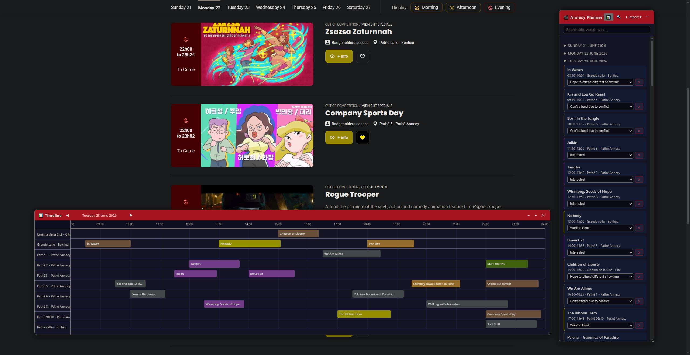
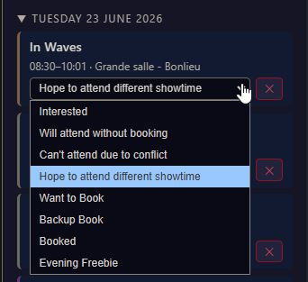

#### Annecy Planner

This is a UserScript you can install with browser extensions like GreaseMonkey or TamperMonkey.  

It adds a floating window to the Annecy Program website, showing your favourite programs. If you already have favourites and they're not showing up in the list, hit the import button while you're in the program list view. The visible programs will be added to the list.  

There's also a timeline view so you can easily see overlaps, and you can assign a handful of statuses to help with your planning.

