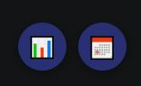
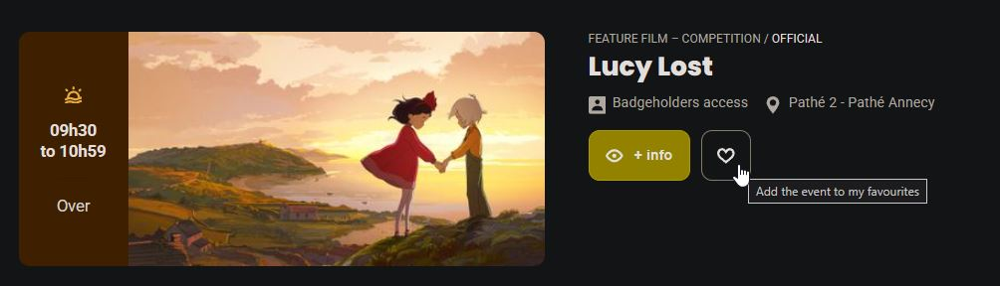
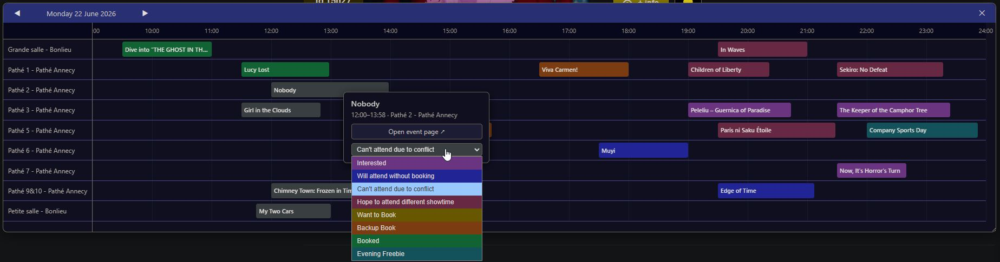
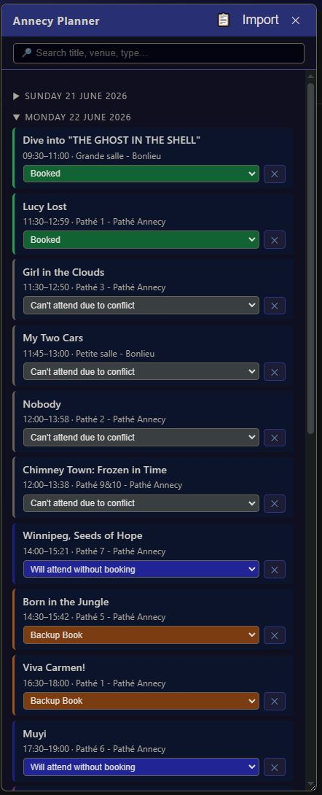
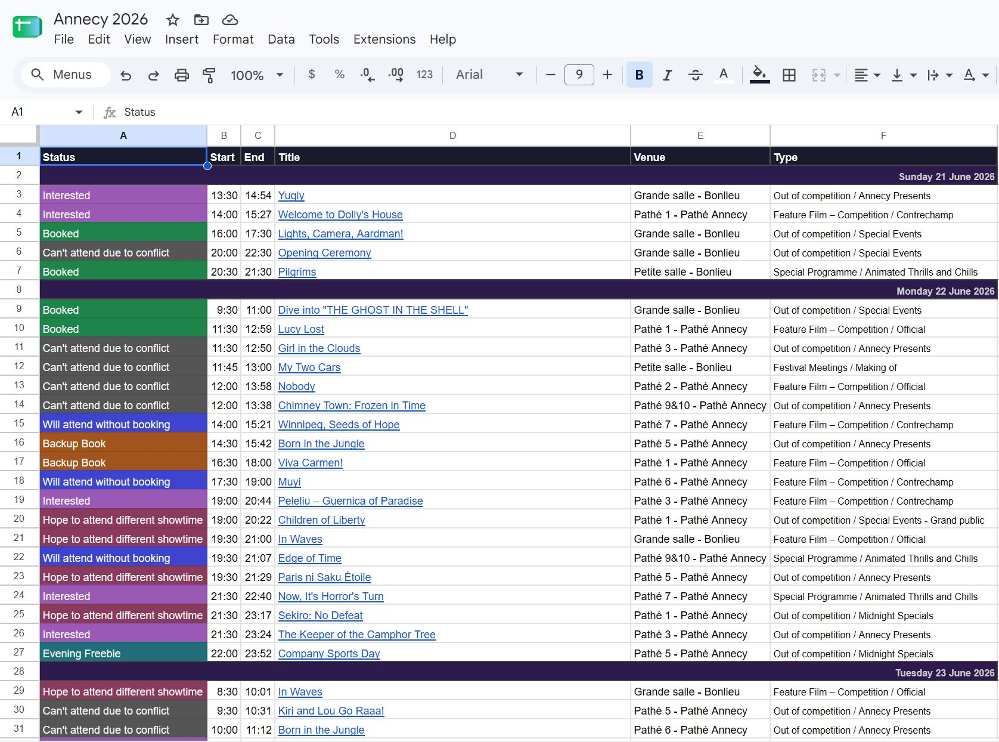

# Annecy Planner

Annecy Planner is a Userscript which adds a floating window to the Annecy Program website, showing your favourite programs, and letting you assign a handful of statuses to them. Originally developed for 2026, so if the festival ever reworks its website, this userscript may need updating.

## Installation

You need to have a browser extension that adds Userscript support to your browser:

| Browser | Extension |
| --- | --- |
| Chrome / Brave / Opera | [Tampermonkey](https://chromewebstore.google.com/detail/tampermonkey/dhdgffkkebhmkfjojejmpbldmpobfkfo) |
| Firefox | [Violentmonkey](https://addons.mozilla.org/en-US/firefox/addon/violentmonkey/) or [Tampermonkey](https://addons.mozilla.org/en-US/firefox/addon/tampermonkey/) |
| Edge | [Tampermonkey](https://microsoftedge.microsoft.com/addons/detail/tampermonkey/iikmkjmpaadaobahmlepeloendndfphd) |
| Safari | [Userscripts](https://apps.apple.com/app/userscripts/id1463298887) or [Tampermonkey](https://apps.apple.com/app/tampermonkey/id1482490089) |

Then simply click here: 

## Workflow

### 1. Opening the Planner
After installation, open https://programme.annecyfestival.com/ and log in. You should see two new icons appear in the bottom-right of the page, for the timeline and the list view respectively:

  

### 2. Marking Favourites
The planner will keep track of events which you mark as favourite on the Annecy website, with their native Favourite button:

  

Now go through the programme and mark all the events you're interested in as Favourite. The planner should stay in sync as you do this.

#### Filtering Advice
- If you're interested in screenings, I highly recommend restricting the "Location" filter to Bonlieu and Pathé, because other venues are much further away, and often screen without English language. They are for locals who live in Annecy.
- Even in Pathé, there are quite a few screenings with original (non-English) language and French subs. If you don't speak French, keep an eye out for this!
- Open-air screenings are never subtitled, and even English productions will be dubbed French. These are aimed at children and families who live in Annecy.
- There's not much point in booking late night events (10pm onwards). You can always get in to those without a reservation.
- Note that many movies being shown are not new, and you can watch them on your own time outside of the festival. If you aren't interested in those, check the filtering categories - Films in competition are always new films, but not all new films are necessarily in competition.

#### Fix Missing Favourites
If you already have favourites and they're not showing up in the list, open a page with the missing events, eg. on [your favourites](https://programme.annecyfestival.com/en/program?favorites=true) page, then hit the "Import" button in the top-right. The visible favourited programs will be added to the list.

### 3. Using the Timeline

By clicking the 📊 icon, you can open a timeline view of your favourites. The timeline displays one day at a time, with the arrows at the top allowing you to switch to different days. In the timeline, you can see your favourite events sorted by time and location. This is super helpful to prioritize while seeing overlapping events, since you can't be in two places at once.

### 4. Assign Priority Status

For each event, you should assign a priority status. Since you can only book 2 events per day, these priorities will later help you decide which two to pick for each day. You can do this both in the timeline and the list view.

The intended use for each status:
- **Interested**: This is the default status, not yet determined whether you can actually attend or not.
- **Will attend without booking**: Use this for events for which you plan to stand in the non-reservation queue. This implies you will queue up for this event 30-90 minutes before it starts.
- **Can't attend due to conflict**: Self-explanatory, this status is here to remind yourself why you're not attending something you'd otherwise be interested in. This status also gets assigned automatically when pressing the Import button, and confirmed conflicting bookings are detected on the current page.
- **Hope to attend different showtime**: If a film you're interested in has several showtimes and you're committed to one, you can use this status for all the rest, again as a reminder as to why you're not booking this one.
- **Want to Book**: Status for before bookings open. You only get 2 bookings per day, so you should only assign this status to 2 events per day.
- **Backup Book**: If you're slow or unlucky, you will not be fast enough to book both of your 2 primary targets on a given day. In such cases, it's good to have a backup event that you want to spend your booking on instead, so it doesn't go to waste.
- **Booked**: Status for a confirmed booking. This status also gets assigned automatically when pressing the Import button, and confirmed bookings are detected on the current page.
- **Evening Freebie**: To be used for late night screenings you want to catch without a reservation.

In the end, you should have a list full of the things you're interested in, with your level of interest expressed by the statuses.

### 5. Prepare for Booking Day: ⏰ **Set an alarm**! ⏰

Some weeks before the festival, you should receive an email about the date and time of when bookings are going to open. That date and time will be 1 week before the festival, on a Tuesday (MIFA), Wednesday (Festival), or Thursday (Students), depending on your accreditation type. You should set an alarm on your phone for 2:45pm CEST for that day, because the bookings will open at 3PM CEST. 

That should give you enough time to finish what you're doing, and open the URLs you need to open. Make sure that the device on which you've used the planner is available to you at this time, or save your list of URLs somewhere where you can access it.

### 6. Booking Day

When your alarm goes off, open the programme website, then open the event pages in separate tabs in the following order:
- Your 2 primary booking targets for each day
- Sort these by how popular you estimate them to be: Consider not only whether it's from a popular studio, but also how much competition there is for that timeslot. A movie on Saturday/Sunday with no competition could be very popular, even if it's a no-name movie.
- Your back-up bookings, if any, in case you fail to book any of your primary targets.
- Any other bookings you might be interested in, in case the back-up also fails.

Now, here's the tech to achieve what I achieved in 2026, which was booking all 14 of my primary targets:
- Shift+Select all of these tabs in your browser, make sure the left-most is the active one, which should be your most desired event. And yes, browsers can select multiple tabs, I didn't know either until I did.
- When the clock hits 3:00pm CEST, start pressing Ctrl+R on those tabs until you notice a "Reserve" button appear. If you spam it too much, it won't load enough of the page to let that button appear.
- Click Reserve, then Ctrl+Tab to the next tab. This is why we sorted our tabs.
- **If a tab doesn't load, MOVE ON**!!!

After booking, you can go to [your reservations](https://programme.annecyfestival.com/en/program?reservations=true), and hit the Import button again on each day to set those events as Booked, and all time-conflicting events to "Can't attend due to conflict".

### 7. Show off

When friends inevitably ask you what did you book/didn't book, you can show them easily by clicking the 📋 button to copy your planner data to your clipboard, then open a Google Sheets, and hit Ctrl+V. Then share that google sheet with your friends to see what events you'll be able to catch together.

Enjoy the festival!