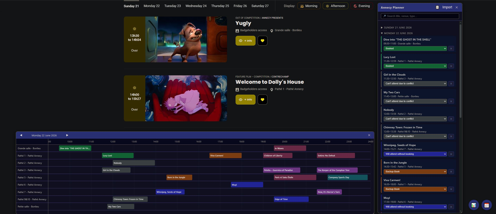
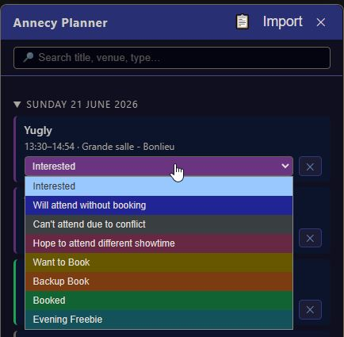

#### Annecy Planner

This is a UserScript you can install with browser extensions like GreaseMonkey or TamperMonkey. Click the button above — if you have one of those extensions installed, it'll open the install prompt automatically.  

It adds a floating window to the Annecy Program website, showing your favourite programs, and letting you assign a handful of statuses to them. If you already have favourites and they're not showing up in the list, hit the import button while you're in the program list view. The visible programs will be added to the list.  

After booking, you can go to your reservations, and hit the Import button again on each day to set those events as Booked, and all time-conflicting events to "Can't attend due to conflict".

There's also a timeline view to help with further planning on what screenings you might want to try to queue for without a reservation, or when to have food breaks or swim breaks.

There's also a button to copy the whole database to your clipboard, letting you paste it into Google Sheets.

